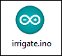
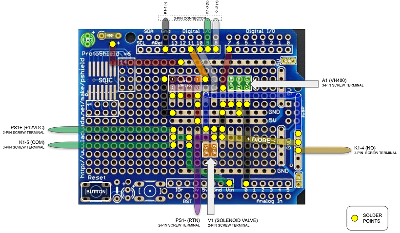
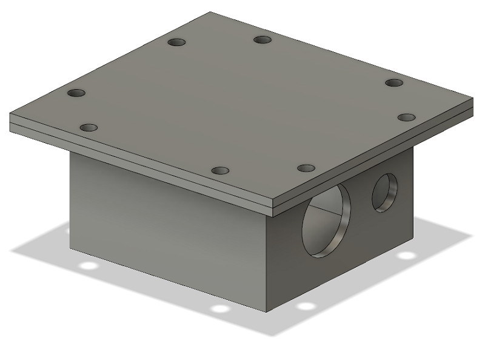
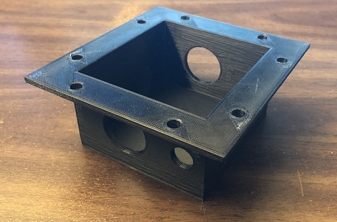
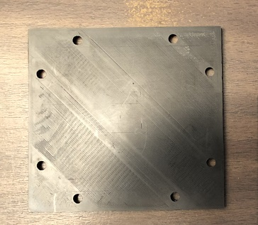

# arduino-irrigate

 ## Introduction
 
 This project contains code, schematics, build plans, and 3D models to construct an automated garden watering system.  The main components of the system are an [Arduino Uno Rev3 microcontroller board](https://store.arduino.cc/usa/arduino-uno-rev3), a [soil moisture sensor](https://vegetronix.com/Products/VH400/), and a [water solenoid valve](https://www.adafruit.com/product/997).  The water solenoid valve is connected to a garden hose and a suitable watering device, such as a sprinkler or sprayer.  I used an old garden hose with holes drilled into it.  
 

   
  
 
 ## Operation
 At a set time interval, the Arduino checks the moisture sensor for a minimum value. If the reading is below the minimum value, the water valve is opened for a period of time.  The moisture readings are sent via [email](https://www.smtp2go.com/setupguide/arduino/) and [text message](https://www.lifewire.com/sms-gateway-from-email-to-sms-text-message-2495456).  The readings are also saved to a [publicly viewable IoT website](https://community.thingspeak.com/tutorials/arduino/send-data-to-thingspeak-with-arduino/) to store data and generate graphs.

&nbsp&nbsp&nbsp&nbsp&nbsp&nbsp&nbsp&nbsp&nbsp

  

## Features
- Allows customizable intervals for soil moisture checks and watering
- Leverages waterproof enclosures and cabling
- Sends email and text message (SMS) status updates
- Provides data monitoring via website
- Supports WiFi for data transmission
- Powered by a single +12VDC source
  

  

## Schematic Diagram

  

## Arduino Code
Developed in Arduino IDE 1.8.9.

  

## Arduino Proto Shield Layout
I used screw terminal blocks and a 2x4 female header to allow for easy disassembly.

  

## 3D Printed Models
I designed a custom waterproof enclosure to house the water solenoid valve. Assembled with a gasket and stainless steel screws. 

 

&nbsp&nbsp&nbsp&nbsp&nbsp&nbsp&nbsp&nbsp&nbsp

  

