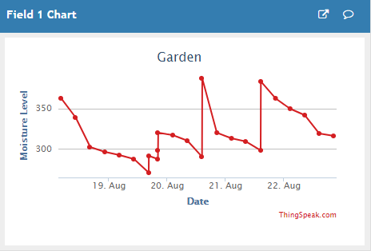

# arduino-irrigate

 ## Description
 
 This project contains code, schematics, build plans, and 3D models to construct an automated garden watering system.  The main components of the system are an Arduino Uno microcontroller board, a moisture sensor, and a water solenoid valve.  The water solenoid valve is connected to a garden hose and a suitable watering device, such as a sprinkler or sprayer.  I used an old garden hose with holes drilled into it.  
 
  

 
 
 ## Operation
 At a set time interval, the Arduino checks the moisture sensor for a minimum value. If the reading is below the minimum value, the water valve is opened for a period of time.  The moisture readings are sent via email and text message.  The readings are also saved to a publicly viewable IoT website to store data and generate graphs.

